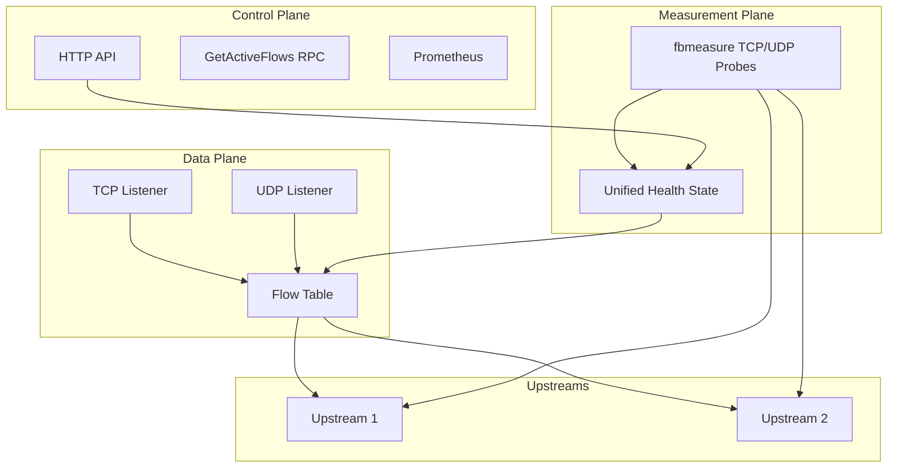
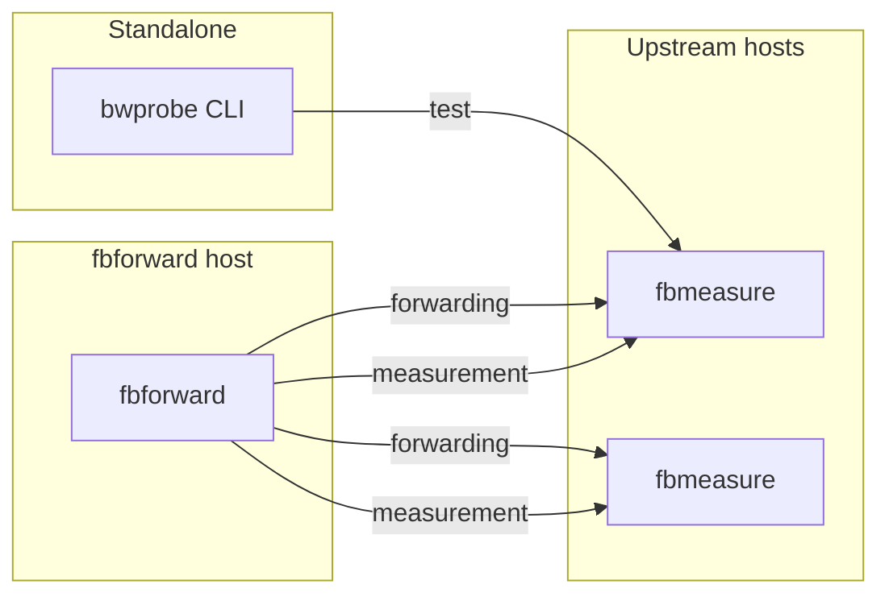
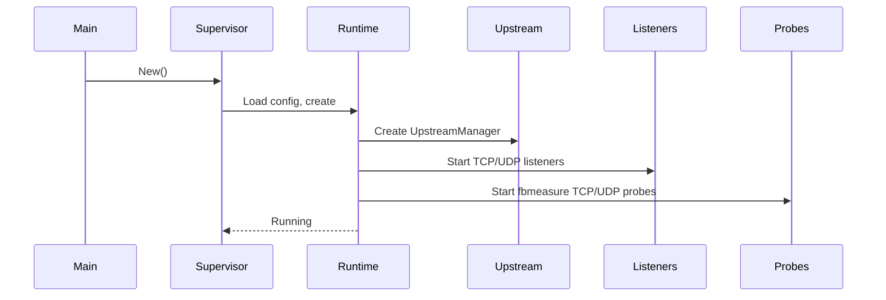

# Project overview

This document describes the fbforward project: what it does, how it is architected, and how its components interact at runtime.

---

## 1.1 Purpose and scope

### Problem statement

Network applications often need to forward traffic to one of several possible upstream servers. Selecting the optimal upstream requires understanding link quality in real time. Static configuration or simple round-robin approaches fail to account for changing network conditions such as packet loss, latency spikes, or bandwidth degradation.

fbforward solves this problem by measuring upstream quality continuously and routing new flows to the best available upstream.

### What fbforward does

fbforward is a TCP/UDP port forwarder that selects upstreams based on measured network quality. The forwarder runs as a single Linux process that:

- Accepts client connections on configured TCP and UDP listeners
- Forwards traffic to one of multiple configured upstreams
- Measures adaptive-route upstream health and RTT using fbmeasure TCP/UDP probes
- Selects the best upstream automatically based on health, RTT, and priority
- Selects upstreams locally within each configured route; cross-node selection is intentionally out of scope
- Pins each flow to its assigned upstream until completion, ensuring in-flight connections are not disrupted
- Can optionally manage GeoIP databases for ASN and country lookups
- Can optionally log IP connections to SQLite with GeoIP enrichment
- Can optionally enforce CIDR/ASN/country firewall rules before upstream selection

The forwarder exposes an API-only control plane with RPC, Prometheus metrics,
and a polling RPC for monitoring and manual control.

### What bwprobe does

bwprobe is a network quality measurement tool included in this repository. The tool runs sample-based bandwidth tests at a specified target rate to measure:

- Throughput (trimmed mean, percentiles, sustained peak)
- Round-trip time and jitter
- Packet loss rate (UDP)
- Retransmit rate (TCP)

bwprobe uses a two-channel design with separate control and data connections to
minimize measurement bias. fbforward no longer embeds bwprobe for continuous
selection; it uses fbmeasure targeted probes instead.

### What fbmeasure does

fbmeasure is the measurement server binary that runs on upstream hosts. The
server accepts targeted TCP and UDP probe traffic from fbforward and reports
RTT results used to update one unified health state.

### Target use cases

fbforward is designed for scenarios where:

- Multiple network uplinks are available with varying quality
- Application traffic must be routed to the best available link
- Link quality changes frequently due to congestion, weather, or provider issues
- Existing flows must not be disrupted when switching upstreams
- Operators need visibility into link quality metrics and manual override capability

Common deployment patterns include multi-homed hosts, mobile network aggregation, and ISP failover configurations.

### Out of scope

fbforward does not:

- Load balance across multiple upstreams (all new flows go to the selected primary)
- Provide application-layer proxying with protocol awareness
- Modify packet contents or perform deep packet inspection
- Replace kernel-level routing or BGP for large-scale networks
- Support platforms other than Linux

---

## 1.2 Architecture overview

fbforward runs as a single process with multiple functional planes operating concurrently.

### Multi-plane design

The architecture separates concerns into several planes:

**Data plane**: Handles actual traffic forwarding. TCP listeners accept client connections and proxy bidirectionally to the assigned upstream. UDP listeners create per-5-tuple mappings and forward packets to the assigned upstream. Each [flow](glossary.md#flow) (TCP connection or UDP mapping) is [pinned](glossary.md#flow-pinning) to an upstream at creation time and remains pinned until termination or expiry.

**Control plane**: Exposes management interfaces. An HTTP server provides JSON-RPC methods for manual upstream selection, configuration reload, status queries (`GetStatus`, `GetActiveFlows`), GeoIP management (`GetGeoIPStatus`, `RefreshGeoIP`), IP-log queries (`GetIPLogStatus`, `QueryIPLog`, `QueryRejectionLog`, `QueryLogEvents`), and operational status. The server also exposes Prometheus metrics at `/metrics`. The root path is API-only and does not serve a web application. All management endpoints require Bearer token authentication. See [Diagram D16](diagrams.md#d16-control-plane-data-flow) for the control plane data flow.

**Measurement plane**: Runs fbmeasure TCP/UDP RTT probes for upstreams used by
adaptive routes. Results update one `HealthSnapshot`; route-local selection
then filters down/cooldown candidates and compares health, RTT, priority, and
configuration order.

**Shaping plane** (optional): Enforces bandwidth limits. When enabled, fbforward configures Linux traffic control (tc) qdiscs via netlink to rate-limit traffic to and from upstreams. Ingress shaping uses an IFB device to redirect incoming traffic through a qdisc.

**GeoIP / IP-log / Firewall plane** (optional): Provides connection-level intelligence and enforcement. When enabled, fbforward manages GeoIP MMDB databases for ASN and country lookups, persists accepted flow-close records plus optional rejection history to SQLite with GeoIP enrichment, and evaluates CIDR/ASN/country firewall rules before upstream selection. Denied flows are rejected immediately and never forwarded; when rejection logging is enabled they are stored in rejection history instead of normal flow-close records.

### Component diagram

<!-- Diagram: D1 Three-plane architecture -->

See [Diagram D1](diagrams.md#d1-three-plane-architecture) for details.

### Binary relationships

The fbforward repository provides three binaries:

**fbforward**: The main forwarder process. Runs on the host where clients
connect. It optionally requires `CAP_NET_ADMIN` for traffic shaping.

**fbmeasure**: The measurement server. Runs on each upstream host at a
configured port (default 9876). Accepts TCP control requests plus TCP/UDP
probe traffic. No special capabilities required.

**bwprobe**: The standalone measurement CLI tool. Can be run independently for manual link testing or used as a library via the `bwprobe/pkg` Go package.

<!-- Diagram: D3 Binary relationships -->

See [Diagram D3](diagrams.md#d3-binary-relationships) for details.

---

## 1.3 Component relationships

This section describes how components are wired together at startup and how they interact during operation.

### Startup sequence

fbforward initializes components in a specific order to ensure dependencies are satisfied:

1. **main()**: Validates Linux platform, parses `--config` flag, creates structured logger
2. **Supervisor**: Loads YAML configuration, validates schema, constructs Runtime
3. **Runtime**:
   - Resolves upstream hostnames via DNS
   - Creates UpstreamManager with health configuration
   - Initializes Metrics aggregator and StatusStore
   - Creates GeoIP manager (if `geoip.enabled`): loads MMDB databases from disk or downloads from URLs, starts background refresh goroutine
   - Creates IP-log store and pipeline (if `ip_log.enabled`): opens SQLite database, starts enrichment/writer goroutines and retention prune loop
   - Creates firewall policy provider: loads and compiles the external policy file (or deprecated inline fallback), wires GeoIP lookups for ASN/country rules, and supports atomic reload
   - Starts the measurement collector only for upstreams used by adaptive routes
   - Creates and starts TCP/UDP listeners for each configured bind address
   - Starts ControlServer with RPC and metrics endpoints
4. **Running state**: All goroutines operational, system ready to accept flows

<!-- Diagram: D4 Startup sequence -->

See [Diagram D4](diagrams.md#d4-startup-sequence) for details.

### Data flow between planes

**Flow creation**: When a client connects to a TCP listener or sends a UDP packet to a UDP listener, the forwarder checks the [flow table](glossary.md#flow-table). If no entry exists, the route-local selector chooses an upstream and the forwarder pins the new Flow to it. The forwarder then establishes a connection to that upstream (TCP) or creates a dedicated socket pair (UDP).

**Traffic forwarding**: The data plane proxies packets bidirectionally between client and upstream without inspecting contents. TCP uses `io.Copy` in both directions. UDP uses dedicated socket pairs to preserve 5-tuple identity.

**Quality measurement**: The measurement plane runs fbmeasure TCP/UDP RTT
observations on a configurable schedule and updates the shared health snapshot.

**Upstream selection**: Adaptive routes select locally by health, RTT, priority,
and configuration order. Static routes use their configured upstream. Manual
and manual preferences are constrained to the route, and existing Flows remain
pinned.

**Status propagation**: The measurement plane updates the StatusStore on every measurement cycle. The control plane returns current status through authenticated RPC snapshots and aggregates metrics for Prometheus scraping.

### Shutdown and restart lifecycle

**Graceful shutdown**: On SIGINT or SIGTERM, the Supervisor calls `Runtime.Stop()`. The Runtime closes all listeners (rejecting new flows), waits for active TCP connections to close or timeout, removes UDP mappings, stops probes, and shuts down the control plane.

**Hot reload**: The control plane exposes a `Restart` RPC method. When invoked, the Supervisor constructs a new Runtime with the updated configuration, stops the old Runtime, and starts the new one. Existing flows are terminated during the transition.

### Concurrency model

fbforward uses goroutines for concurrency:

- One goroutine per TCP connection for bidirectional copying
- One goroutine per UDP listener for packet dispatching
- One goroutine for fbmeasure probe scheduling
- Control-plane request handlers are ordinary HTTP handlers; there is no status-stream goroutine.
- One goroutine for GeoIP refresh loop (if `geoip.enabled`)
- Two goroutines for IP-log pipeline: enrichment worker and batch writer (if `ip_log.enabled`)
- One goroutine for IP-log retention pruning (if `ip_log.enabled`)

All goroutines receive a context derived from `Runtime.ctx`. Canceling the context triggers shutdown. Components use channels for cross-goroutine communication and `sync.RWMutex` for shared state access.
# Current selection model

The active implementation uses a unified upstream health state and RTT EWMA.
Older references to composite scoring in this document describe historical
behavior and are not valid configuration or runtime concepts.
