# Diagram inventory

This document catalogs all diagrams required for the fbforward documentation. Each entry includes purpose, target section, and a Mermaid template where applicable.

---

## Architecture diagrams

### D1: Three-plane architecture

**Section:** 1.2 Architecture overview
**Purpose:** Show high-level system architecture with data plane, control plane, and measurement plane
**Type:** Block diagram

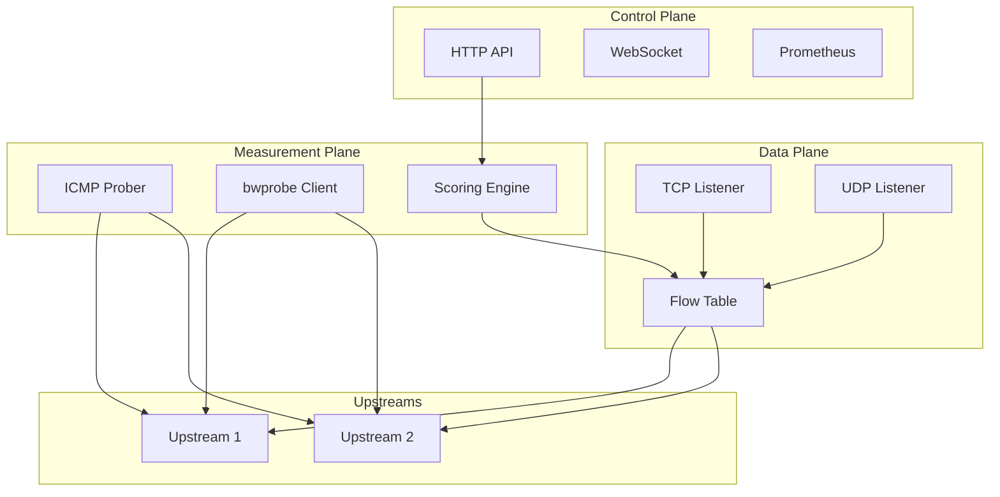

### D2: Component dependency graph

**Section:** 7.1 Architecture deep dive
**Purpose:** Show Go package dependencies within internal/
**Type:** Directed graph

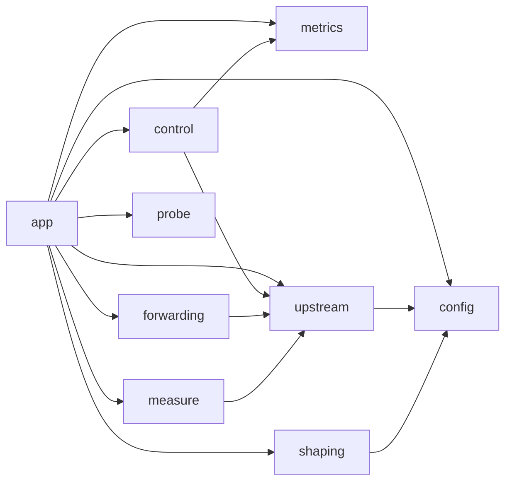

### D3: Binary relationships

**Section:** 1.2 Architecture overview
**Purpose:** Show how fbforward, bwprobe, and fbmeasure relate
**Type:** Block diagram

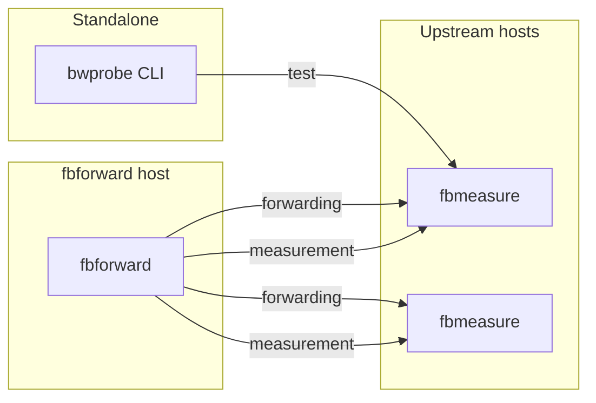

---

## Data flow diagrams

### D4: Startup sequence

**Section:** 1.3 Component relationships
**Purpose:** Show initialization order from main() to running state
**Type:** Sequence diagram

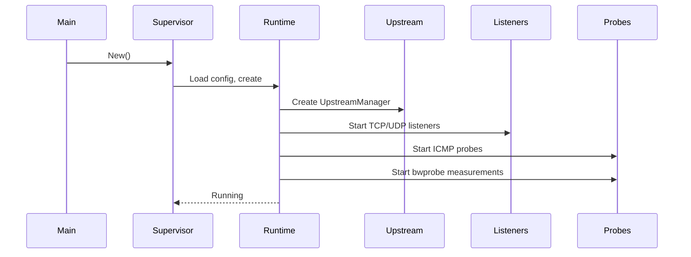

### D5: Flow pinning lifecycle

**Section:** 6.1.1 Overview
**Purpose:** Show TCP/UDP flow creation, pinning, and removal
**Type:** State diagram

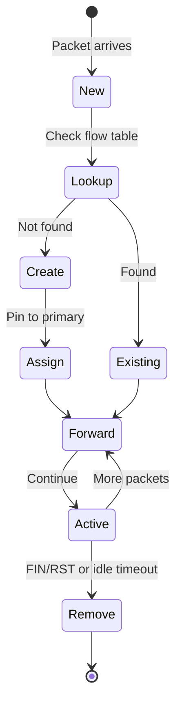

### D6: Request flow (TCP)

**Section:** 3.1.1 Overview
**Purpose:** Show client connection through fbforward to upstream
**Type:** Sequence diagram

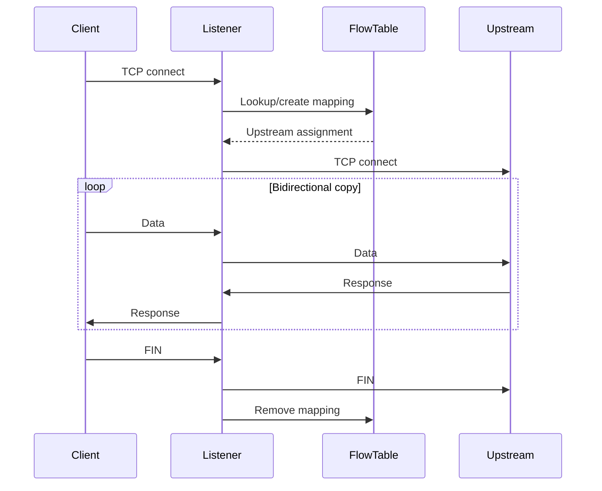

### D7: Configuration flow

**Section:** 3.1.2 Configuration
**Purpose:** Show config loading from YAML to runtime components
**Type:** Flowchart

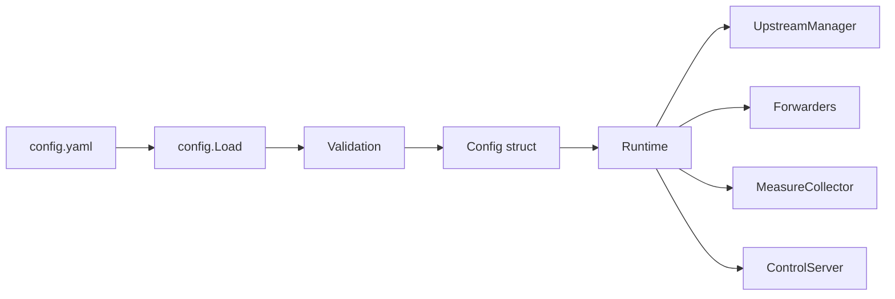

---

## Measurement diagrams

### D8: bwprobe two-channel design

**Section:** 6.2.1 Overview
**Purpose:** Show control and data channel separation
**Type:** Block diagram

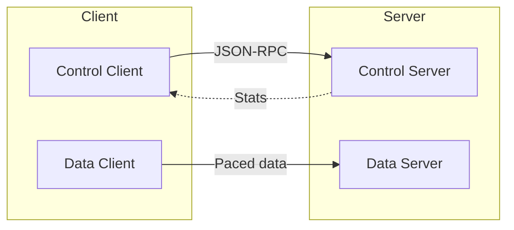

### D9: Sample-based testing model

**Section:** 6.2.1 Overview
**Purpose:** Show sample lifecycle with control messages
**Type:** Sequence diagram

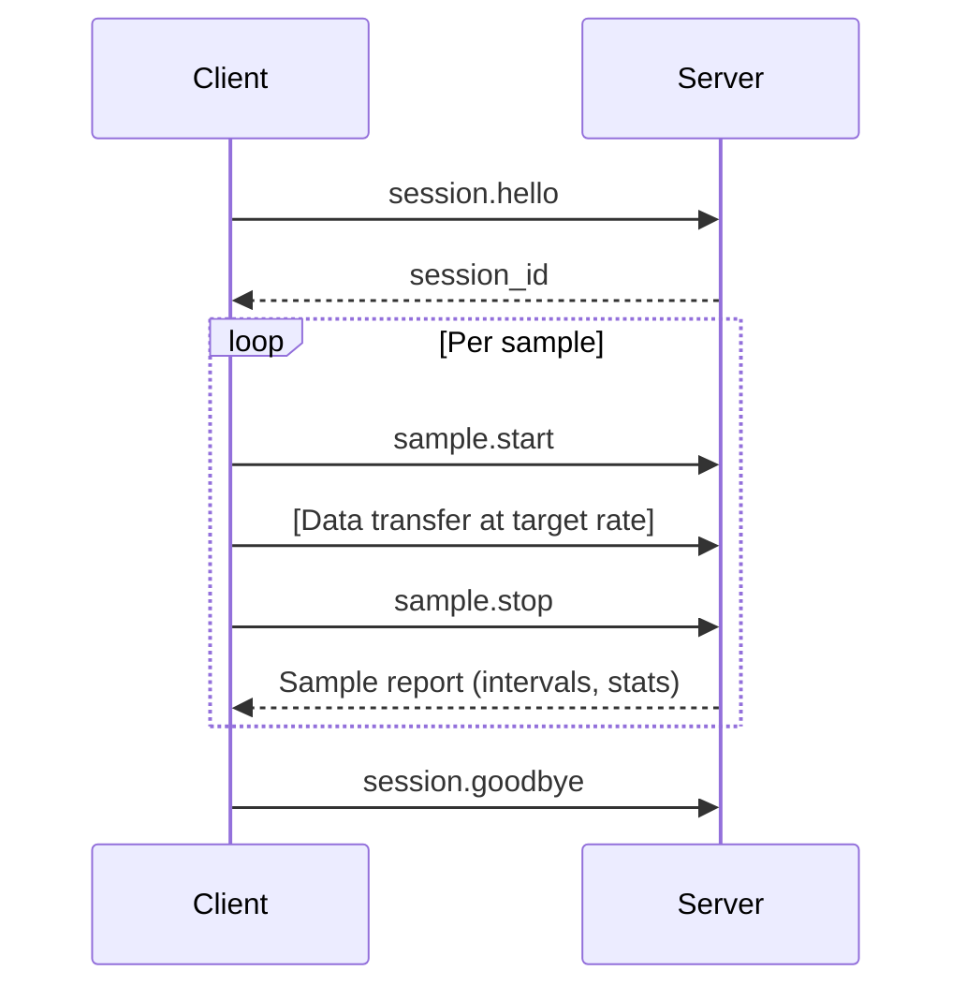

### D10: Scoring algorithm flow

**Section:** 6.1.2 Formal description
**Purpose:** Show score calculation from metrics to final score
**Type:** Flowchart

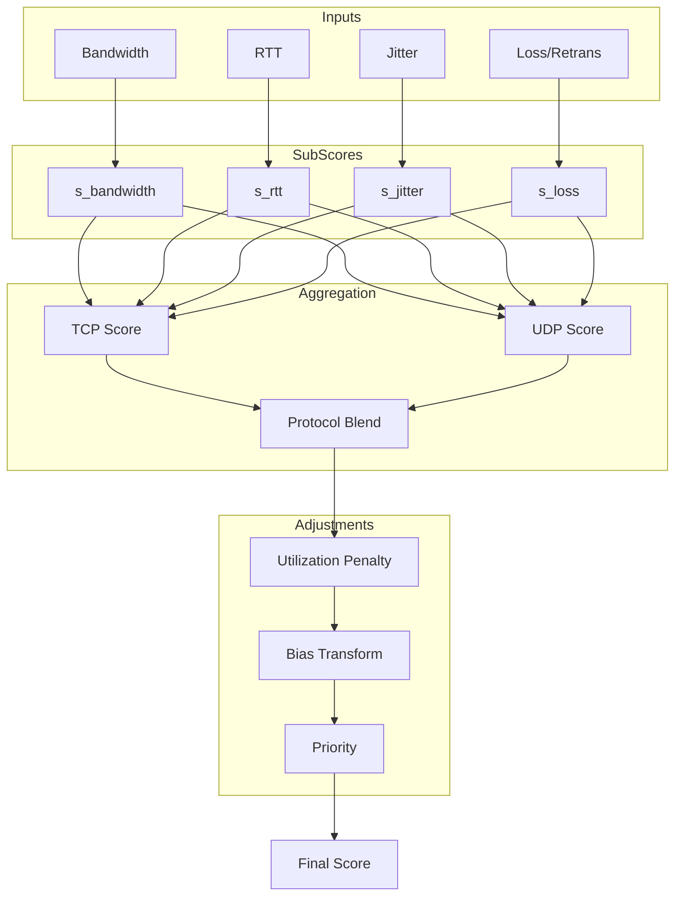

---

## Switching diagrams

### D11: Upstream state machine

**Section:** 6.1.4 Edge cases
**Purpose:** Show upstream usability states and transitions
**Type:** State diagram

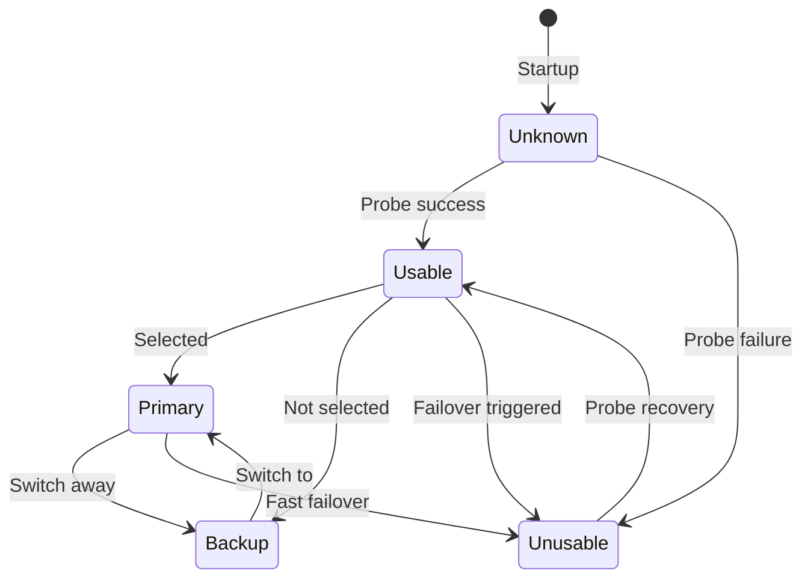

### D12: Auto mode switching decision

**Section:** 4.8 Switching section
**Purpose:** Show decision tree for automatic upstream switching
**Type:** Flowchart

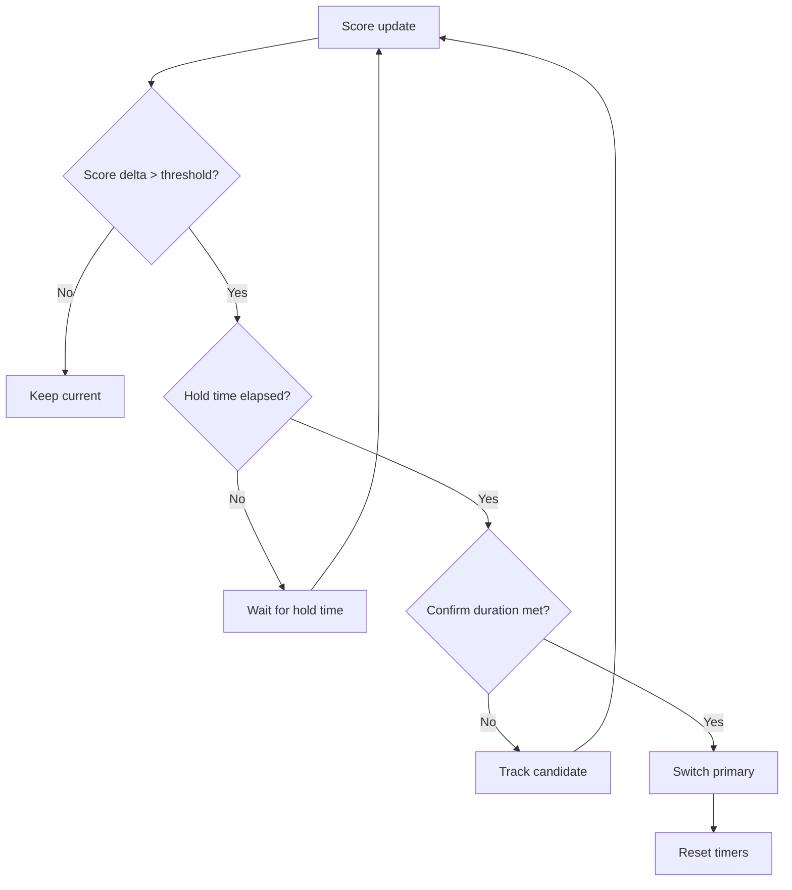

---

## Protocol diagrams

### D13: JSON-RPC message framing

**Section:** 6.3.1 Overview
**Purpose:** Show wire format of control messages
**Type:** Block diagram

```text
+----------------+------------------------+
| Length (4B BE) | JSON-RPC message       |
+----------------+------------------------+
|   0x00000042   | {"jsonrpc":"2.0",...}  |
+----------------+------------------------+
```

### D14: Control plane API structure

**Section:** 5.2.1 Overview
**Purpose:** Show HTTP endpoint hierarchy
**Type:** Tree

```text
/
├── GET  /          → Web UI (SPA)
├── POST /rpc       → JSON-RPC methods
├── GET  /metrics   → Prometheus metrics
└── GET  /status    → WebSocket stream
```

---

## Shaping diagrams

### D15: Traffic shaping architecture

**Section:** 4.10 Shaping section
**Purpose:** Show Linux tc integration with IFB for bidirectional shaping
**Type:** Block diagram

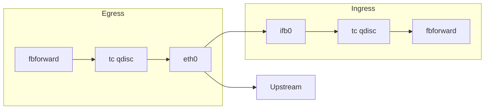

---

## Control plane diagrams

### D16: Control plane data flow

**Section:** 5.2 Control plane API, 3.1.3 Operation
**Purpose:** Show how UI/clients interact with control plane endpoints
**Type:** Sequence diagram

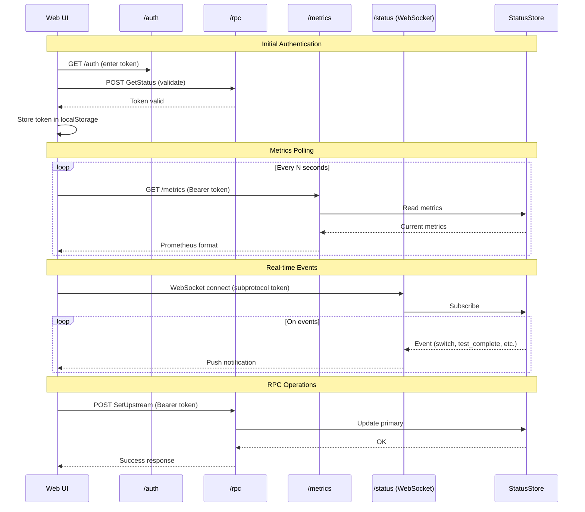

**Data flow patterns:**

| Endpoint | Method | Purpose | Auth |
|----------|--------|---------|------|
| `/` | GET | Serve web UI SPA | None |
| `/auth` | GET | Token input page | None |
| `/rpc` | POST | JSON-RPC operations | Bearer token |
| `/metrics` | GET | Prometheus scraping | Bearer token |
| `/status` | GET | WebSocket stream | Subprotocol token |

---

## Summary

| ID | Name | Type | Section |
|----|------|------|---------|
| D1 | Three-plane architecture | Block | 1.2 |
| D2 | Component dependency graph | Directed graph | 7.1 |
| D3 | Binary relationships | Block | 1.2 |
| D4 | Startup sequence | Sequence | 1.3 |
| D5 | Flow pinning lifecycle | State | 6.1.1 |
| D6 | Request flow (TCP) | Sequence | 3.1.1 |
| D7 | Configuration flow | Flowchart | 3.1.2 |
| D8 | bwprobe two-channel design | Block | 6.2.1 |
| D9 | Sample-based testing model | Sequence | 6.2.1 |
| D10 | Scoring algorithm flow | Flowchart | 6.1.2 |
| D11 | Upstream state machine | State | 6.1.4 |
| D12 | Auto mode switching decision | Flowchart | 4.8 |
| D13 | JSON-RPC message framing | Block | 6.3.1 |
| D14 | Control plane API structure | Tree | 5.2.1 |
| D15 | Traffic shaping architecture | Block | 4.10 |
| D16 | Control plane data flow | Sequence | 5.2, 3.1.3 |
