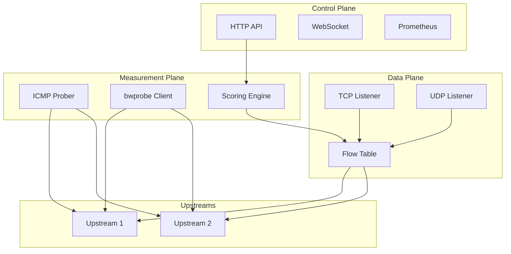
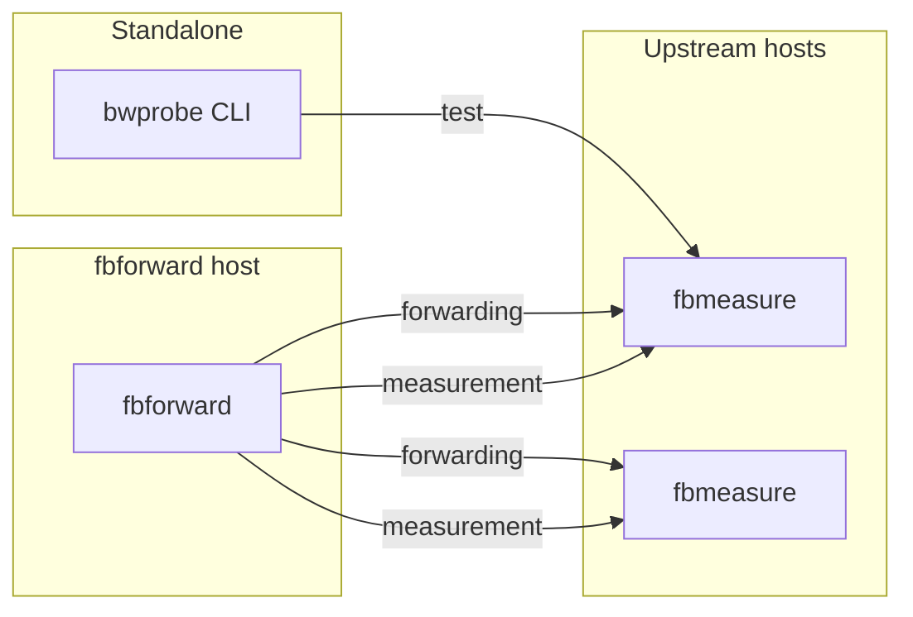
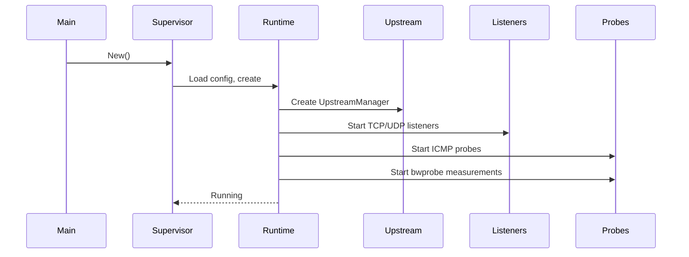

# Project overview

This document describes the fbforward project: what it does, how it is architected, and how its components interact at runtime.

---

## 1.1 Purpose and scope

### Problem statement

Network applications often need to forward traffic to one of several possible upstream servers. Selecting the optimal upstream requires understanding link quality in real time. Static configuration or simple round-robin approaches fail to account for changing network conditions such as packet loss, latency spikes, or bandwidth degradation.

fbforward solves this problem by measuring upstream quality continuously and routing new flows to the best available upstream.

### What fbforward does

fbforward is a TCP/UDP port forwarder that selects upstreams based on measured network quality. The forwarder runs as a single Linux process that:

- Accepts client connections on configured TCP and UDP listeners
- Forwards traffic to one of multiple configured upstreams
- Measures upstream quality using bwprobe bandwidth tests and ICMP reachability probes
- Selects the best upstream automatically based on a composite quality score
- Pins each flow to its assigned upstream until completion, ensuring in-flight connections are not disrupted

The forwarder exposes a control plane with HTTP API, Prometheus metrics, WebSocket status stream, and an embedded web UI for monitoring and manual control.

### What bwprobe does

bwprobe is a network quality measurement tool included in this repository. The tool runs sample-based bandwidth tests at a specified target rate to measure:

- Throughput (trimmed mean, percentiles, sustained peak)
- Round-trip time and jitter
- Packet loss rate (UDP)
- Retransmit rate (TCP)

bwprobe uses a two-channel design with separate control and data connections to minimize measurement bias. fbforward uses bwprobe to test upstream links continuously.

### What fbmeasure does

fbmeasure is the measurement server binary that runs on upstream hosts. The server accepts bwprobe test connections and reports receive-side statistics back to the client. fbforward requires fbmeasure running on each upstream to perform bandwidth measurements.

### Target use cases

fbforward is designed for scenarios where:

- Multiple network uplinks are available with varying quality
- Application traffic must be routed to the best available link
- Link quality changes frequently due to congestion, weather, or provider issues
- Existing flows must not be disrupted when switching upstreams
- Operators need visibility into link quality metrics and manual override capability

Common deployment patterns include multi-homed hosts, mobile network aggregation, and ISP failover configurations.

### Out of scope

fbforward does not:

- Load balance across multiple upstreams (all new flows go to the selected primary)
- Provide application-layer proxying with protocol awareness
- Modify packet contents or perform deep packet inspection
- Replace kernel-level routing or BGP for large-scale networks
- Support platforms other than Linux

---

## 1.2 Architecture overview

fbforward runs as a single process with four functional planes operating concurrently.

### Three-plane design

The architecture separates concerns into three main planes:

**Data plane**: Handles actual traffic forwarding. TCP listeners accept client connections and proxy bidirectionally to the assigned upstream. UDP listeners create per-5-tuple mappings and forward packets to the assigned upstream. Each [flow](glossary.md#flow) (TCP connection or UDP mapping) is [pinned](glossary.md#flow-pinning) to an upstream at creation time and remains pinned until termination or expiry.

**Control plane**: Exposes management interfaces. An HTTP server provides JSON-RPC methods for manual upstream selection, configuration reload, and status queries. The server also exposes Prometheus metrics at `/metrics`, a WebSocket endpoint at `/status` for real-time status streaming, and an embedded single-page application at `/` for web UI access. All endpoints except `/` (UI root) and `/auth` (token input) require Bearer token authentication. See [Diagram D16](diagrams.md#d16-control-plane-data-flow) for the control plane data flow.

**Measurement plane**: Assesses upstream quality. ICMP probes test reachability continuously. bwprobe measurements run periodic TCP and UDP bandwidth tests against each upstream's measurement endpoint. The [scoring engine](glossary.md#scoring-engine) combines metrics into a quality score using exponential normalization and configurable weights. The [upstream manager](glossary.md#upstream-manager) selects the [primary upstream](glossary.md#primary-upstream) based on scores and switching policy.

**Shaping plane** (optional): Enforces bandwidth limits. When enabled, fbforward configures Linux traffic control (tc) qdiscs via netlink to rate-limit traffic to and from upstreams. Ingress shaping uses an IFB device to redirect incoming traffic through a qdisc.

### Component diagram

<!-- Diagram: D1 Three-plane architecture -->

See [Diagram D1](diagrams.md#d1-three-plane-architecture) for details.

### Binary relationships

The fbforward repository provides three binaries:

**fbforward**: The main forwarder process. Runs on the host where clients connect. Requires `CAP_NET_RAW` for ICMP probing and optionally `CAP_NET_ADMIN` for traffic shaping.

**fbmeasure**: The measurement server. Runs on each upstream host at a configured port (default 9876). Accepts bwprobe control and data connections. No special capabilities required.

**bwprobe**: The standalone measurement CLI tool. Can be run independently for manual link testing or used as a library via the `bwprobe/pkg` Go package.

<!-- Diagram: D3 Binary relationships -->

See [Diagram D3](diagrams.md#d3-binary-relationships) for details.

---

## 1.3 Component relationships

This section describes how components are wired together at startup and how they interact during operation.

### Startup sequence

fbforward initializes components in a specific order to ensure dependencies are satisfied:

1. **main()**: Validates Linux platform, parses `--config` flag, creates structured logger
2. **Supervisor**: Loads YAML configuration, validates schema, constructs Runtime
3. **Runtime**:
   - Resolves upstream hostnames via DNS
   - Creates UpstreamManager with scoring configuration
   - Initializes Metrics aggregator and StatusStore
   - Runs fast-start mode: Performs lightweight TCP dial probes to each upstream's measurement endpoint, computes fast-start scores from dial RTT, and selects initial primary
   - Starts ICMP prober for reachability monitoring (does not affect scoring)
   - Starts bwprobe measurement collector for full TCP/UDP bandwidth tests
   - Creates and starts TCP/UDP listeners for each configured bind address
   - Starts ControlServer with RPC, metrics, WebSocket, and UI endpoints
4. **Running state**: All goroutines operational, system ready to accept flows

<!-- Diagram: D4 Startup sequence -->

See [Diagram D4](diagrams.md#d4-startup-sequence) for details.

### Data flow between planes

**Flow creation**: When a client connects to a TCP listener or sends a UDP packet to a UDP listener, the forwarder checks the [flow table](glossary.md#flow-table). If no entry exists, the forwarder creates a new entry pinned to the current primary upstream. The forwarder then establishes a connection to that upstream (TCP) or creates a dedicated socket pair (UDP).

**Traffic forwarding**: The data plane proxies packets bidirectionally between client and upstream without inspecting contents. TCP uses `io.Copy` in both directions. UDP uses dedicated socket pairs to preserve 5-tuple identity.

**Quality measurement**: The measurement plane runs bwprobe tests on a configurable schedule. Each test transfers sample data at a target rate and collects metrics. The scoring engine updates upstream scores using exponential moving average (EMA) smoothing. When scores change, the upstream manager evaluates switching conditions.

**Upstream selection**: In auto mode, the manager compares the candidate upstream's score against the current primary's score. If the delta exceeds the threshold for the configured confirmation duration, the manager switches the primary. In manual mode, the operator selects an upstream via RPC, and the manager validates usability before accepting.

**Status propagation**: The measurement plane updates the StatusStore on every measurement cycle. The control plane serves current status via HTTP GET, streams updates via WebSocket, and aggregates metrics for Prometheus scraping.

### Shutdown and restart lifecycle

**Graceful shutdown**: On SIGINT or SIGTERM, the Supervisor calls `Runtime.Stop()`. The Runtime closes all listeners (rejecting new flows), waits for active TCP connections to close or timeout, removes UDP mappings, stops probes, and shuts down the control plane.

**Hot reload**: The control plane exposes a `Restart` RPC method. When invoked, the Supervisor constructs a new Runtime with the updated configuration, stops the old Runtime, and starts the new one. Existing flows are terminated during the transition.

### Concurrency model

fbforward uses goroutines for concurrency:

- One goroutine per TCP connection for bidirectional copying
- One goroutine per UDP listener for packet dispatching
- One goroutine for ICMP probe loop
- One goroutine for bwprobe measurement scheduling
- One goroutine per control plane endpoint (RPC, WebSocket, metrics)

All goroutines receive a context derived from `Runtime.ctx`. Canceling the context triggers shutdown. Components use channels for cross-goroutine communication and `sync.RWMutex` for shared state access.
