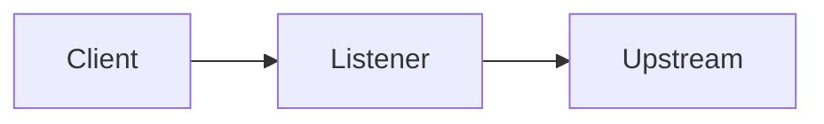
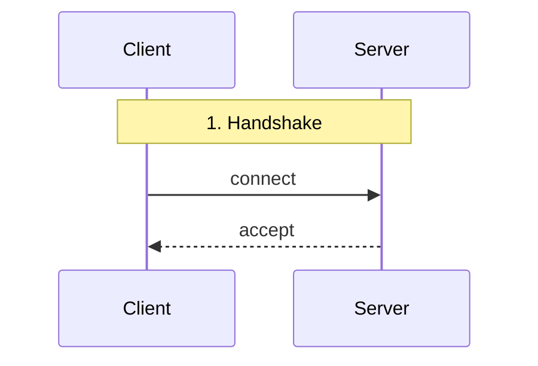

# Documentation style guide

This guide establishes conventions for all fbforward documentation. Follow these guidelines to maintain consistency across documents.

---

## 1. Tone

### 1.1 Technical and precise

Avoid vague language. Use exact terms defined in the [glossary](glossary.md).

| Avoid | Prefer |
|-------|--------|
| "the system handles traffic" | "the forwarder proxies TCP connections" |
| "it runs fast" | "latency is under 1ms" |
| "the data goes to the server" | "the client sends frames to the data channel" |

### 1.2 Neutral

State facts. Avoid marketing language or superlatives.

| Avoid | Prefer |
|-------|--------|
| "fbforward is the best solution" | "fbforward selects upstreams based on measured quality" |
| "extremely reliable" | "recovers automatically when probes succeed" |
| "blazing fast" | "adds <1ms forwarding latency" |

### 1.3 Active voice

Write in active voice. The subject performs the action.

| Avoid (passive) | Prefer (active) |
|-----------------|-----------------|
| "Tests are run by the scheduler" | "The scheduler runs tests" |
| "Connections are accepted by the listener" | "The listener accepts connections" |
| "Scores are computed by the scoring engine" | "The scoring engine computes scores" |

### 1.4 Person

- **Second person for instructions:** Address the reader directly.
  - "Configure the listener" not "One should configure the listener"
  - "Set the auth_token field" not "The auth_token field should be set"

- **Third person for descriptions:** Describe system behavior objectively.
  - "The manager selects upstreams" not "We select upstreams"
  - "The prober sends ICMP packets" not "We send ICMP packets"

---

## 2. Structure conventions

### 2.1 Headings

- Use sentence case: "Configuration reference" not "Configuration Reference"
- Maximum 4 heading levels (H1-H4)
- H1 reserved for document title only
- Include section numbers for reference documents

```markdown
# Configuration reference       ← H1: document title only

## 4.2 forwarding section       ← H2: numbered section

### listeners                   ← H3: subsection

#### bind_addr                  ← H4: field-level (deepest)
```

### 2.2 Paragraphs

- Lead with the main point (inverted pyramid style)
- Maximum 5 sentences per paragraph
- One concept per paragraph
- Separate paragraphs with blank lines

**Example:**

```markdown
The flow table maps active connections to upstreams. Each entry contains a
5-tuple key and the assigned upstream tag. TCP entries are removed on FIN/RST.
UDP entries expire after the configured idle timeout.
```

### 2.3 Lists

- Bulleted for unordered collections
- Numbered for sequences or ranked items
- Maximum 7 items before grouping into sublists
- End items with periods if they are complete sentences

**Unordered (features, options):**

```markdown
The forwarder supports:

- TCP connections with idle timeout
- UDP mappings with configurable TTL
- Per-listener rate limiting
```

**Ordered (steps, procedures):**

```markdown
To restart fbforward:

1. Connect to the control API.
2. Call the `Restart` RPC method.
3. Verify status via WebSocket or `/metrics`.
```

### 2.4 Code blocks

- Always specify language for syntax highlighting
- Include only relevant excerpts, not full files
- Add inline comments for non-obvious lines
- Show expected output where applicable

```yaml
# Example: minimal upstream configuration
upstreams:
  - tag: primary
    destination:
      host: 10.0.0.1          # Upstream IP address
    measurement:
      port: 9876              # fbmeasure port (default)
```

```bash
# Build and run
make build-fbforward
./build/bin/fbforward --config config.yaml
# Expected: "listening on 0.0.0.0:9000"
```

### 2.5 Tables

- Use for structured comparisons (config options, flags, types)
- Include header row with column names
- Align numeric columns right; text columns left
- Keep tables under 7 columns for readability

```markdown
| Field | Type | Default | Description |
|-------|------|--------:|-------------|
| bind_addr | string | 0.0.0.0 | Listen address |
| bind_port | int | 9000 | Listen port |
| protocol | string | tcp | Protocol (tcp or udp) |
```

---

## 3. Terminology

### 3.1 Glossary usage

- Use terms consistently throughout all documents
- Define on first use in each document, linking to glossary
- Never use synonyms for the same concept

**First use:**

```markdown
The [primary upstream](glossary.md#primary-upstream) receives all new flow
assignments.
```

**Subsequent uses:**

```markdown
When the primary upstream becomes unusable, the scoring engine selects a new
primary.
```

### 3.2 Forbidden synonyms

| Canonical term | Do not use |
|----------------|------------|
| upstream | server, backend, destination (when referring to upstream) |
| flow | connection (when referring to both TCP and UDP) |
| primary | active, current, selected |
| listener | endpoint, bind |
| forwarder | proxy (use forwarder for fbforward component) |

### 3.3 Abbreviations

- Define on first use: "round-trip time (RTT)"
- Use abbreviation consistently after definition
- Common abbreviations (defined in glossary): RTT, EMA, TCP, UDP, RPC, API

---

## 4. Diagrams

### 4.1 When to include

- Architecture overviews (component relationships)
- Data flows (request lifecycle)
- State machines (mode transitions)
- Sequence diagrams (protocol exchanges)

### 4.2 Format

- Use Mermaid syntax for maintainability
- Include diagram title as HTML comment
- Keep diagrams under 15 nodes for readability
- Use consistent shapes:
  - Rectangles for components
  - Diamonds for decisions
  - Rounded rectangles for states
  - Arrows for flow

```markdown
<!-- Diagram: Request flow -->

```

### 4.3 Labeling

- Label all arrows with action or data type
- Include legend for non-obvious symbols
- Number steps in sequence diagrams



### 4.4 Placement

- Place diagrams immediately after the text that introduces them
- Reference diagrams by ID: "See Diagram D1"
- All diagrams are cataloged in [diagrams.md](diagrams.md)

---

## 5. Cross-references

### 5.1 Internal references

- Use relative links for same-document references
- Use document-relative paths for cross-document references
- Include section numbers: "See Section 4.2.3"

```markdown
See [Section 4.2](outline.md#42-forwarding-section) for listener configuration.
```

### 5.2 Code references

- Link to specific files using relative paths
- Include line numbers for specific definitions: `config.go:42`
- Use `monospace` for inline code references

```markdown
The forwarder is implemented in
[forward_tcp.go](../internal/forwarding/forward_tcp.go). The flow table
lookup occurs at line 125.
```

### 5.3 External references

- Link to official documentation for dependencies
- For potentially unstable URLs, note the access date
- Prefer stable documentation links (versioned if available)

```markdown
See the [Go net package documentation](https://pkg.go.dev/net) for socket
options.
```

---

## 6. File naming

### 6.1 Documentation files

- Use lowercase with hyphens: `configuration-reference.md`
- Match section names where possible
- Keep names short but descriptive

### 6.2 Images and assets

- Store in `docs/assets/` directory
- Use descriptive names: `architecture-overview.png`
- Prefer SVG for diagrams (scalable)

---

## 7. Formatting checklist

Before submitting documentation changes, verify:

- [ ] Headings use sentence case
- [ ] Maximum 4 heading levels
- [ ] Active voice throughout
- [ ] No superlatives or marketing language
- [ ] Code blocks have language specified
- [ ] Tables have header row
- [ ] New terms link to glossary
- [ ] Cross-references use relative links
- [ ] Diagrams are under 15 nodes
- [ ] Section numbers match outline

---

## 8. Examples

### 8.1 User guide section

```markdown
## 3.1.3 Operation

### Starting fbforward

Start fbforward with the `--config` flag pointing to your configuration file.
The process requires CAP_NET_RAW for ICMP probing.

```bash
sudo setcap cap_net_raw+ep ./build/bin/fbforward
./build/bin/fbforward --config /etc/fbforward/config.yaml
```

fbforward logs to stderr by default. Verify startup by checking for the
"listening" message:

```
2025/01/15 10:00:00 INFO listening addr=0.0.0.0:9000 protocol=tcp
```

### Monitoring

Access the web UI at `http://localhost:8080/` (or your configured
`control.bind_addr:control.bind_port`). The dashboard shows:

- Current primary upstream
- Per-upstream scores and metrics
- Active flow counts
```

### 8.2 Configuration reference section

```markdown
## 4.2 forwarding section

The `forwarding` section configures listeners and flow management.

### listeners

List of listener definitions. Each listener binds to an address and accepts
client connections.

| Field | Type | Default | Description |
|-------|------|--------:|-------------|
| bind_addr | string | 0.0.0.0 | Address to bind |
| bind_port | int | *required* | Port to bind |
| protocol | string | tcp | Protocol: `tcp` or `udp` |
| shaping | object | *none* | Per-listener rate limits |

**Example:**

```yaml
forwarding:
  listeners:
    - bind_addr: 0.0.0.0
      bind_port: 9000
      protocol: tcp
```

See [Section 4.10](outline.md#410-shaping-section) for shaping configuration.
```

### 8.3 Algorithm specification section

```markdown
## 6.1.2 Formal description

### Sub-scores

Each metric is normalized to [ε, 1] where ε = 0.001.

**Bandwidth (higher is better):**

$$s_{B} = \max\left(1 - \exp\left(-B / B^{\mathrm{ref}}\right), \varepsilon\right)$$

The exponential form ensures diminishing returns: doubling bandwidth does not
double the score. This prevents high-bandwidth links from dominating when all
upstreams exceed the reference value.

**RTT (lower is better):**

$$s_{R} = \max\left(\exp\left(-R / R^{\mathrm{ref}}\right), \varepsilon\right)$$

Lower RTT yields higher scores. The reference value $R^{\mathrm{ref}}$
(default: 50ms) represents the target latency. See
[Section 6.1.3](outline.md#613-parameters) for parameter configuration.
```
